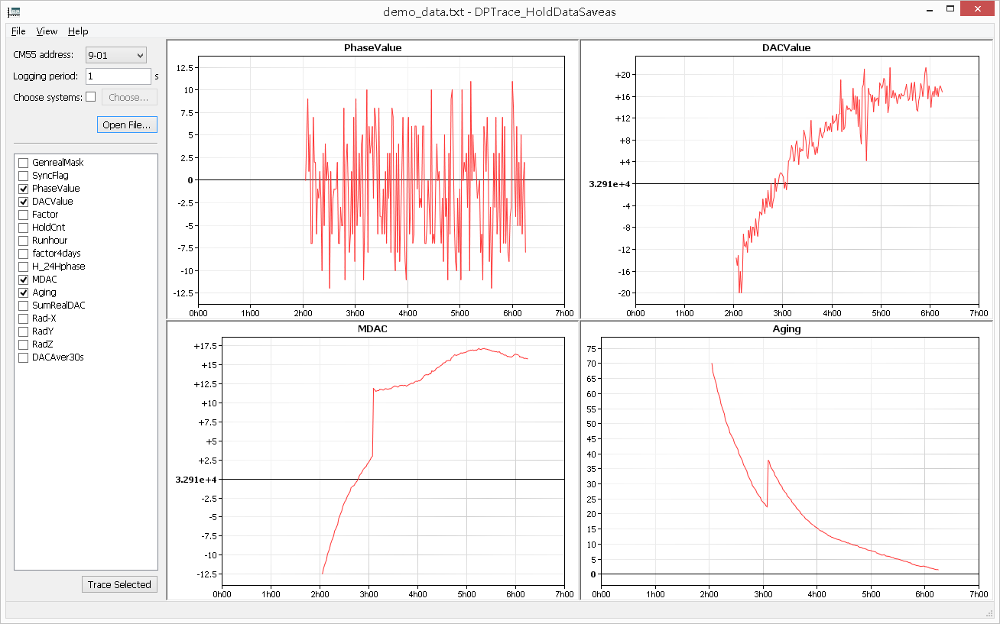
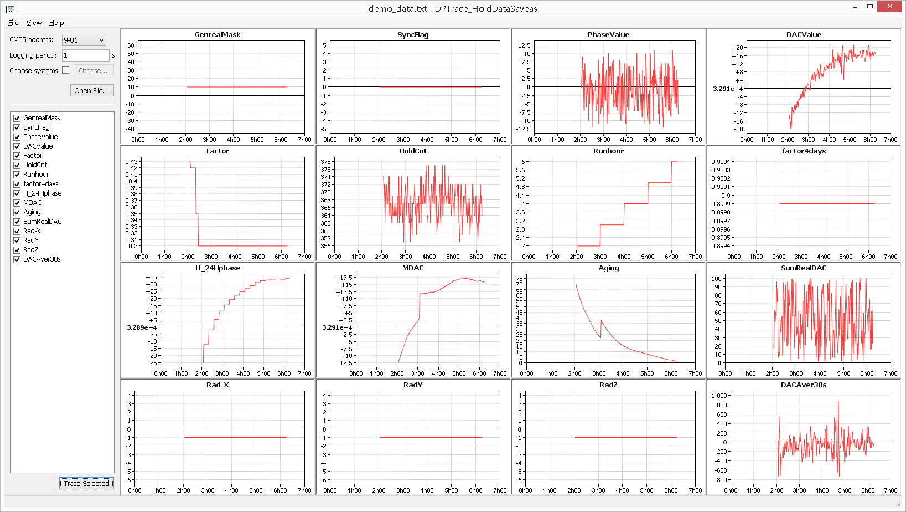

1、使用VS2010打开DPTrace.sln进行编译

2、运行exe在code\software\DPTrace\Output\Release下

	chartdir50.dll 	---exe运行需要使用的库文件；

	demo_data.txt	---用软件打开查看数据的一个样例数据；.

3、生成的软件exe以及打开txt数据的部分截图如下：

可做参考使用wxwidgets开发小工具和复杂的软件GUI！

